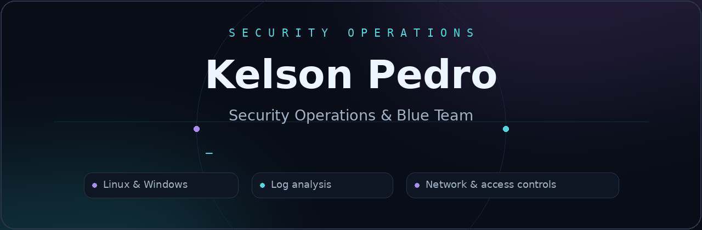
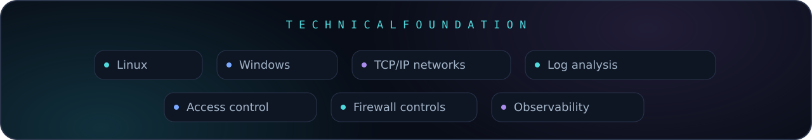
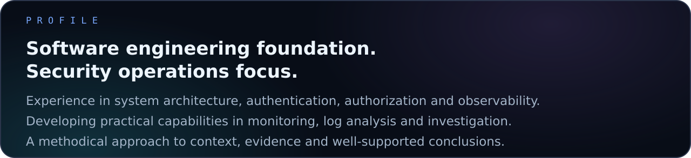
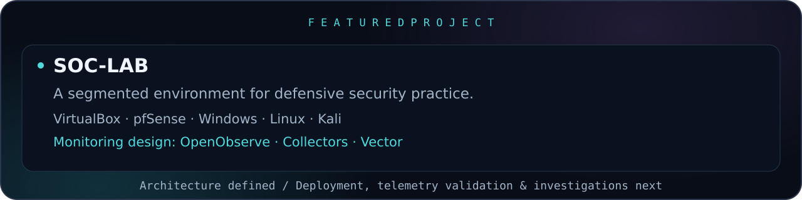
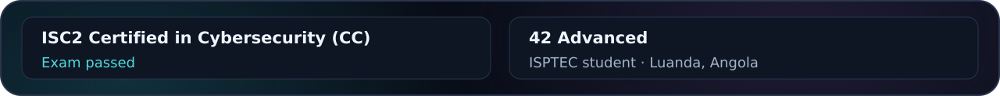

  

  <a href="https://www.linkedin.com/in/kelsonpedro/"><strong>LinkedIn ↗</strong></a>
  &nbsp;&nbsp; · &nbsp;&nbsp;
  <a href="https://github.com/Kelson-D-Pedro/SOC-LAB"><strong>SOC-LAB ↗</strong></a>
  &nbsp;&nbsp; · &nbsp;&nbsp;
  <a href="https://www.kelsonpedro.me/"><strong>Portfolio ↗</strong></a>

  

<strong>Seeking a SOC Analyst L1 opportunity.</strong>

<strong>Profile &amp; project details</strong>

My software development experience spans system architecture, authentication, authorization and observability. It provides a foundation for understanding application behavior and the events systems produce.

My professional focus is **Security Operations and Blue Team**. I am developing practical capabilities in monitoring, log analysis and investigation, with an emphasis on context, clear evidence and well-supported conclusions.

**Education:** **ISPTEC** — student · **42 Advanced** — training. Based in Luanda, Angola.

SOC-LAB is a segmented virtual environment for defensive security practice, with pfSense as the central firewall/router, Windows and Linux endpoints, and Kali on a separate exercise network. Its purpose is to connect endpoint and network telemetry with detection, alert triage and investigation.

[Explore SOC-LAB](https://github.com/Kelson-D-Pedro/SOC-LAB)

<strong>Backend development &amp; engineering background</strong>

Backend supports my understanding of services, data flows and authentication.

- [**Webserv**](https://github.com/Kelson-D-Pedro/webserv) — C++ HTTP server, sockets, protocol behavior and Linux.
- [**TaskFlow API**](https://github.com/Kelson-D-Pedro/TaskFlow-API) — REST API, authentication, data modeling and backend architecture.

Node.js · NestJS · TypeScript · C/C++ · PostgreSQL · Docker

   
  <a href="https://www.linkedin.com/in/kelsonpedro/"><strong>Let's connect on LinkedIn ↗</strong></a>

