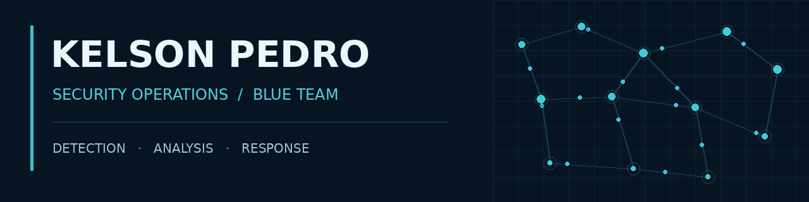

  

  <a href="https://www.linkedin.com/in/kelsonpedro/"><strong>LinkedIn</strong></a>
  &nbsp; · &nbsp;
  <a href="https://www.kelsonpedro.me/"><strong>Portfolio</strong></a>
  &nbsp; · &nbsp;
  <a href="https://github.com/Kelson-D-Pedro/SOC-LAB"><strong>SOC-LAB</strong></a>

## About

My experience in software development includes system architecture, authentication, authorization and observability. This foundation helps me understand how applications behave and connect that behavior with the events they produce.

My professional focus is **Security Operations and Blue Team**, developing practical capabilities in monitoring, log analysis and investigation. I value the context behind an alert, clear evidence and well-supported conclusions that help a team decide what to do next.

**Seeking a SOC Analyst L1 opportunity**, bringing analytical reasoning, programming ability and a methodical approach to investigating and documenting security events.

---

## SOC-LAB

**A segmented environment for defensive security practice.**

My lab brings together a firewall, Windows and Linux endpoints, a central monitoring platform and a separate machine for controlled adversary simulation. It connects infrastructure, network controls and endpoint telemetry in one environment.

| Infrastructure | Security operations |
| :--- | :--- |
| Five virtual machines in VirtualBox | Centralized endpoint telemetry |
| pfSense and three logical networks | Monitoring and event analysis |
| Windows 10 and Linux Server | Authentication and system activity |
| Kali in a separate exercise network | Controlled activity and its defensive visibility |

**Current stage:** infrastructure and initial configuration established; the monitoring architecture has been redesigned around **OpenObserve**, with endpoint collectors and **Vector** for pfSense Syslog. The redesign follows memory constraints encountered with the initial Wazuh stack. Deployment validation, detection work and investigation evidence are the next stages.

[**Explore SOC-LAB →**](https://github.com/Kelson-D-Pedro/SOC-LAB)

## Technical foundation

**Linux & Windows** · **TCP/IP & network segmentation** · **Firewall controls** · **Authentication & access control** · **Log analysis**

Passed the **ISC2 Certified in Cybersecurity (CC) exam**.

---

<strong>Backend development — supporting engineering background</strong>

 

Backend remains part of my technical foundation: understanding services, data flows and authentication supports the way I approach security.

- [**Webserv**](https://github.com/Kelson-D-Pedro/webserv) — C++ HTTP server, sockets, protocol behavior and Linux.
- [**TaskFlow API**](https://github.com/Kelson-D-Pedro/TaskFlow-API) — REST API, authentication, data modeling and backend architecture.

Node.js · NestJS · TypeScript · C/C++ · PostgreSQL · Docker

   
  <strong>Luanda, Angola</strong> &nbsp; · &nbsp; 42 Advanced
   
  <a href="https://www.linkedin.com/in/kelsonpedro/">Connect on LinkedIn</a>

